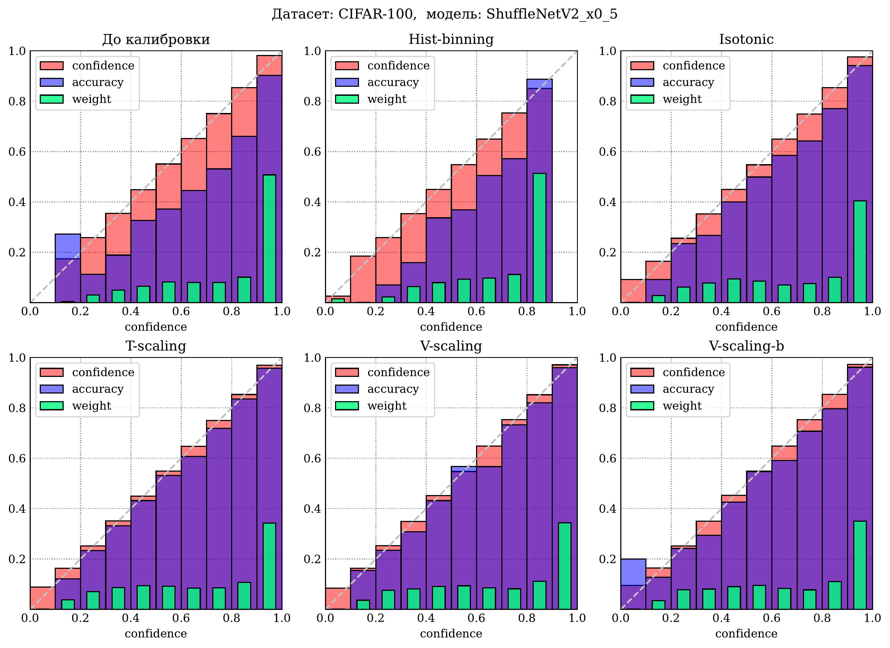

# Калибровка уверенности нейронных сетей *(Calibration of Neural Networks)*

* ### Курсовая работа: [calibration.pdf](calibration.pdf).
* ### Реализация методов калибровки, метрик, диаграмм: [calib/](calib).

* Все-все-все диаграммы надежности находятся [здесь (первая группа моделей)](cw_paper/vis/ReliabilityDiagrams_group_1.pdf) и [здесь (вторая группа)](cw_paper/vis/ReliabilityDiagrams_group_2.pdf).
* Ноутбуки с экспериментами — [notebooks/](notebooks), можно воспроизвести все этапы работы. Логиты нейросетей (на валидации и тесте) также [доступны для загрузки](https://disk.yandex.ru/d/9Awu1nwJOZv4Lg).
